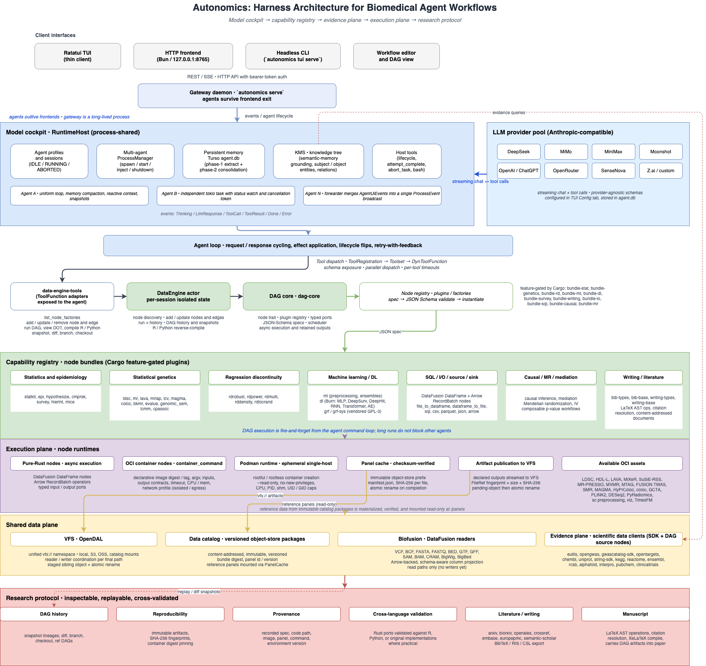
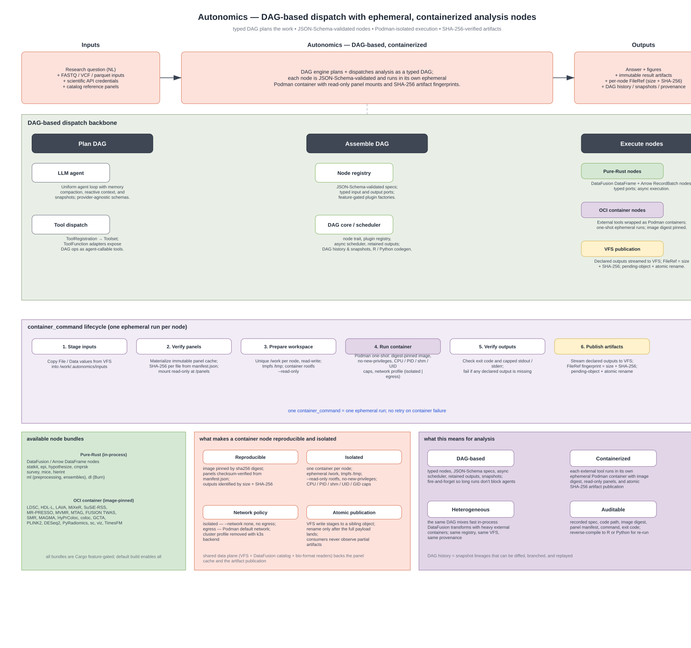

# autonomics / agentik

[English](README.md) | [中文](README_zh.md)

Autonomics 是一个专门为生物医学科研设计的 harness。它把 LLM 智能体接入一个类型化、可审计的科研执行面：智能体可以发现已注册的分析节点，组装 DataFusion DAG，读取科研数据，运行纯 Rust 或 OCI 容器方法，通过虚拟文件系统持久化结果，并进一步把分析结果整理成有文献支撑的稿件。流行病学、统计遗传学、临床与调查分析、机器学习、科研数据库和可复现执行被当作同一条科研工作流，而不是彼此独立的应用。

根 Cargo 工作空间在本版 README 更新时包含 96 个 crate。这是一个活跃研究代码库，API、节点契约和配置路径仍可能调整。`dendrite/` 是独立的嵌套 Rust 工作空间，用于知识管理系统。

## Harness 契约

这里的 “harness” 指模型与科研方法外围的承重基础设施：

- **模型驾驶舱**：服务商/模型配置、流式对话、工具 schema、记忆、生命周期和多智能体编排。
- **能力注册表**：经 JSON Schema 校验的工具和类型化 DAG 节点，把分析、I/O、source、sink 与写作操作暴露给模型。
- **证据面**：生物医学科研 API、文献服务、全文存储、文献库记录、引文和知识树访问共享同一个运行时。
- **执行面**：DataFusion、Arrow、VFS、不可变数据包、Podman 和参考面板缓存负责执行并保留工作产物。
- **科研协议**：DAG 历史、快照、diff、分支、来源信息、不可变 artifact 和数值交叉验证让智能体工作可检查、可重放。

Autonomics 不是通用聊天应用，不是围绕自由脚本的 notebook 替代品，也不是单体 pipeline；它是把模型接入受校验科研能力、并记录实际运行过程的 harness。

## 演示


## Harness 架构



该架构把模型编排和科研能力分开。每个智能体会话都有独立的 `DataEngine` actor，同时进程内共享不可变的注册表和运行时基础设施。DAG 执行对智能体命令循环是 fire-and-forget 的，一个长时间分析不会阻塞其他智能体。启用 DAG history 后，每次运行会形成可检查、可 diff、可分支、可 checkout 的快照链。

```text
Ratatui TUI(瘦客户端)──REST/SSE──▶  gateway daemon(`autonomics serve`)
        |                                     |
        |                                     v
        └──────────── events ────────── RuntimeHost
  (前端退出后 agents 继续运行)
  agents、profiles、sessions、memory、host tools
        |
        | ToolFunction 调用
        v
Data-engine actor
  节点发现、节点增改、边编辑、运行与历史管理
        |
        v
Node registry + DAG scheduler
  JSON Schema 校验的节点参数
  类型化输入/输出端口
  异步执行并保留输出
        |
        +--> SQL、I/O、epi、genetics、ML、DL、survey、
        |     survival、causal、MR、RD、writing 节点包
        |
        +--> DataFusion DataFrame 与 Arrow RecordBatch 节点
        |
        +--> OCI 容器节点
              一次性 Podman 运行
              不可变 panel bundle
              产物发布到 VFS

共享数据面：
  VFS (OpenDAL) -> local、S3、OSS、catalog 挂载
  data catalog  -> 不可变、版本化数据包
  biofusion     -> VCF/BCF/FASTA/FASTQ/BED/GTF/GFF/SAM/BAM/CRAM/BigWig/BigBed 读取
```

## DAG 调度与容器执行



让这个 harness 在生物医学场景里值得信赖的两个核心机制：

- **基于 DAG 的调度**。研究请求由 LLM agent 解析为类型化的 DAG（每个节点都经 JSON Schema 校验），再通过统一的注册表装配。同一个 DAG 既可以混合快速的进程内 DataFusion / Arrow 转换，又可以承载重型外部容器；DAG core 异步调度并保留输出，支持快照、diff 和分支。
- **容器化节点**。每个外部工具都跑在自己的一次性 Podman 容器中：镜像用 sha256 digest 钉死，参考面板用 `manifest.json` 做 SHA-256 校验并以只读方式挂载，rootfs 用 `--read-only` + `no-new-privileges` 并显式限制 CPU / PID / shm / UID，声明的产物以 `FileRef = size + SHA-256` 流式写入 VFS，配合 pending-object + atomic rename，消费方永远不会读到半成品。一次 `container_command` 就是一次一次性运行，容器失败不重试。

## 能力地图

| 领域 | 主要 crate | 提供能力 |
| --- | --- | --- |
| 模型编排 | `agentik-sdk`、`agentik-types`、`agentik-proc`、`agentik-core`、`agentik-network`、`runtime` | 流式 LLM 客户端、工具 schema 与调用、持久记忆、生命周期、多智能体拓扑和同步到异步宿主。 |
| 分析执行 | `dag-core`、`data-engine`、`data-engine-tools`、`crates/node-bundles/*`、`workflow-editor` | 节点 trait、插件注册表、类型化端口、调度器、JSON Schema 参数、智能体工具、快照和可复用 workflow skill。 |
| 数据基础设施 | `vfs`、`data-catalog`、`container-runtime`、`biofusion` | OpenDAL VFS、版本化对象存储数据包、Podman 执行、不可变 panel 缓存，以及生物格式的 DataFusion 读取器。 |
| 统计与流行病学 | `statkit`、`epi`、`hypothesize`、`cmprsk`、`survey`、`mice`、`hierint` | 描述统计与回归；因果推断和中介；可组合检验与 p 值工作流；竞争风险；调查设计；插补；层级交互模型。 |
| 机器学习与深度学习 | `ml`、`dl`、`grf`、`grf-sys` | 预处理、特征工程、聚类、监督模型、集成学习、异常检测、降维；Burn 的 MLP、DeepSurv、DeepHit、RNN、Transformer、autoencoder；通过 vendored C++ 核心运行 generalized random forests。 |
| 统计遗传学 | `ldsc`、`mr`、`lava`、`mrlap`、`lcv`、`cpassoc`、`magma`、`coloc`、`bkmr`、`evalue`、`genomic_sem`、`lcmm` | LD score regression、孟德尔随机化、局部遗传相关、colocalization、Bayesian kernel-machine regression、E-value、Genomic SEM、latent-class mixed models 等。 |
| 断点回归 | `rdrobust`、`rdpower`、`rdmulti`、`rddensity`、`rdlocrand` | 局部多项式 RD 估计、功效与样本量、多 cutoff 设计、manipulation testing、局部随机化推断。 |
| 科研数据客户端 | `eutils`、`opengwas`、`gwascatalog-sdk`、`opentargets`、`chembl`、`uniprot`、`string-sdk`、`kegg`、`reactome`、`ensembl`、`rcsb`、`alphafold`、`interpro`、`pubchem`、`protocolio`、`clinicaltrials` | PubMed/Entrez、OpenGWAS、GWAS Catalog、Open Targets、ChEMBL、UniProt、STRING、KEGG、Reactome、Ensembl、RCSB、AlphaFold、InterPro、PubChem、protocols.io、ClinicalTrials.gov 的 SDK、智能体工具和部分 DAG source 节点。 |
| 文献、写作与知识 | `arxiv`、`biorxiv`、`openalex`、`crossref`、`embase`、`europepmc`、`semantic-scholar`、`bib-types`、`bib-base`、`writing-types`、`writing-base`、`kms`、`kms-tools` | 统一文献检索与全文管理、内容寻址文档、BibTeX/RIS/Markdown/CSL 导出、LaTeX AST 操作、引文解析、编译和知识树工具。 |
| Harness 界面 | `tui`、`tui-http`、`workflow-editor` | 流式终端对话、模型配置、DAG 视图、文献 CLI/API/前端、KMS 浏览器和工作流编辑组件。 |

默认 `data-engine` 构建启用全部 node-bundle Cargo feature。库使用者可以关闭默认 feature，再按需选择 `bundle-*`。

## 插件家族

所有容器化分析节点都以**清单插件**（manifest plugin）形式交付：每个家族
一个目录，包含 `manifest.toml`（节点契约：参数、端口、面板、镜像溯源）、
执行脚本和镜像构建树。插件从钉死 commit SHA 的 git 仓库安装，daemon 启动
前的插件自检阶段完成安装、校验与汇报——格式与工作流见
[节点插件化迁移](docs/plugin-node-migration_zh.md)。

当前发布 24 个家族 / 71 个节点 kind：

| 家族 | 节点 kind | 工具 |
| --- | --- | --- |
| [ldsc](https://github.com/auto-nomics/ldsc-plugin) | `ldsc_h2`、`ldsc_munge`、`ldsc_rg` | LD score 回归（h2 / munge / rg） |
| [magma](https://github.com/auto-nomics/magma-plugin) | `magma_annotate` | MAGMA SNP-基因注释 |
| [mrpresso](https://github.com/auto-nomics/mrpresso-plugin) | `mrpresso` | MR-PRESSO 异质性/离群检验 |
| [mvmr](https://github.com/auto-nomics/mvmr-plugin) | `mvmr` | 多变量孟德尔随机化 |
| [coloc](https://github.com/auto-nomics/coloc-plugin) | `coloc_abf` | 共定位（coloc.abf） |
| [deseq2](https://github.com/auto-nomics/deseq2-plugin) | `deseq2_de` | 差异表达（DESeq2） |
| [gcta](https://github.com/auto-nomics/gcta-plugin) | `gcta_cojo_select`、`gcta_sblup`、`gcta_fastbat`、`gcta_acat` | GCTA 汇总统计套件 |
| [pathway-gsea](https://github.com/auto-nomics/pathway-gsea-plugin) | `pathway_gsea` | fgsea 通路富集 |
| [plink2](https://github.com/auto-nomics/plink2-plugin) | `plink2_clump` | LD clumping（PLINK2） |
| [visualization](https://github.com/auto-nomics/visualization-plugin) | `visualization` | 用户 R 脚本绘图渲染 |
| [mtag](https://github.com/auto-nomics/mtag-plugin) | `mtag` | 多性状 GWAS 分析 |
| [smr](https://github.com/auto-nomics/smr-plugin) | `smr_heidi`、`smr_heidi_eqtlgen` | SMR 与 HEIDI（Westra / eQTLGen） |
| [susie](https://github.com/auto-nomics/susie-plugin) | `susie_rss` | SuSiE 精细定位（RSS） |
| [twosamplemr](https://github.com/auto-nomics/twosamplemr-plugin) | `twosamplemr`、`twosamplemr_harmonise` | TwoSampleMR 与协调 |
| [mixer](https://github.com/auto-nomics/mixer-plugin) | `mixer_fit1`、`mixer_fit2` | gsa-mixer fit1 / fit2 |
| [music](https://github.com/auto-nomics/music-plugin) | `music_deconvolution` | MuSiC 细胞类型去卷积 |
| [mutation](https://github.com/auto-nomics/mutation-plugin) | `mutation_analysis`、`mutation_analysis_clinical` | maftools 突变图谱 |
| [timesfm](https://github.com/auto-nomics/timesfm-plugin) | `timesfm_forecast` | TimesFM 预测（离线 checkpoint） |
| [twas](https://github.com/auto-nomics/twas-plugin) | `twas_fusion` | FUSION TWAS 基因表达 |
| [hdl](https://github.com/auto-nomics/hdl-plugin) | `hdl_l`、`hdl_l_scan` | HDL-L 遗传力与染色体扫描 |
| [lava](https://github.com/auto-nomics/lava-plugin) | `lava`、`lava_scan` | 局部遗传相关与扫描 |
| [single-cell](https://github.com/auto-nomics/single-cell-plugin) | `single_cell_preprocessor`、10 个 `h5ad_*` / `gene_set_score` / `sc_dense_ingest` 变体 | scRNA 预处理与 H5AD 分析 |
| [radiomics](https://github.com/auto-nomics/radiomics-plugin) | 21 个 `radiomics_*` / `pyradiomics_*` 变体 | 影像特征提取流水线 |
| [pathology](https://github.com/auto-nomics/pathology-plugin) | 7 个 `pathology_*` 变体 | WSI 切片摄取 / QC / 嵌入 / IHC |

### 安装插件

在 `~/.autonomics/plugins.toml` 声明家族；`autonomics serve` 在 daemon
启动前运行自检阶段：按钉死的 rev 安装每个家族（git clone 或本地 `path`
符号链接）、以 fail-closed 方式校验全部清单、汇报注册的 kind：

```toml
[[plugin]]
name = "ldsc"
git = "https://github.com/auto-nomics/ldsc-plugin.git"
rev = "6f7118d61dd60ca7ce95d7d524ccec3880d96026"   # 钉死的 commit SHA
```

本地开发使用 `path` 源（符号链接——改文件后重启即生效，无需重装）：

```toml
[[plugin]]
name = "mtag"
path = "/mnt/projects/node-plugins/mtag"
```

## Harness 工作空间结构

```text
autonomics/
├── apps/autonomics/                     终端应用和 CLI 子命令
├── crates/
│   ├── agentik-*/                LLM SDK、类型、过程宏、运行时与网络
│   ├── dag-core/                 DAG trait、注册表和调度器
│   ├── data-engine/              DataFusion 引擎与 node-bundle 装配
│   ├── data-engine-tools/        DAG 操作的 Agent ToolFunction 适配器
│   ├── node-bundles/             feature-gated 分析节点插件
│   ├── vfs/                      OpenDAL VFS 与 vbash 工具
│   ├── data-catalog/             版本化数据包 catalog
│   ├── container-runtime/        Podman 执行与不可变 panel 缓存
│   ├── biofusion*/               生物格式 DataFusion 读取器与缓存
│   ├── runtime/                  RuntimeHost 与共享智能体基础设施
│   ├── bib-*/writing-*/kms*      文献、稿件和知识系统
│   └── ...                       科研 API SDK 与支撑 crate
├── bio_crates/                   遗传学、causal forest、RD 等方法
├── stat_crates/                  统计、流行病学、ML、插补和 DL
├── containers/                   外部分析运行时的 OCI 定义
├── fixtures/                     代表性有效与错误格式测试输入
├── docs/                         设计文档和专题指南
├── infra/                        本地参考数据准备工具
├── dendrite/                     独立嵌套的知识管理工作空间
└── tests/                        跨语言验证辅助脚本
```

`reference/` 存放第三方与对照材料，不属于根 Cargo 构建。

## 快速开始

### 构建并运行 TUI

环境要求：

- Rust 1.85 或更新版本；构建使用 checked-in `Cargo.lock` 以保持可复现。
- C/C++ 编译器，用于 vendored GRF 核心。
- 使用 OCI 节点、panel bundle、radiomics、visualization 或 TimesFM 时需要 Podman。
- 可选：XeLaTeX 用于稿件编译；Bun 用于 TUI HTTP 前端；R 用于部分交叉验证脚本。

```bash
git clone --recurse-submodules <repository-url>
cd autonomics
cargo run -p autonomics
```

首次完整构建较大。如果默认 target 目录不合适，设置 `CARGO_TARGET_DIR=/path/to/target`。

工作空间二进制名为 `tui`。安装或复制为 `autonomics` 后，可以使用：

```bash
autonomics tui
autonomics kms
autonomics cache refresh-opengwas
autonomics bib list
```

通过 Cargo 运行时，子命令放在 `--` 之后，例如：

```bash
cargo run -p autonomics -- cache refresh-opengwas
cargo run -p autonomics -- bib list
```

### 配置运行时

模型服务商在 TUI Config 标签页配置并保存到应用数据库。内置 preset 包括 DeepSeek、MiMo、MiniMax、Moonshot、OpenAI/ChatGPT、OpenRouter、SenseNova 和 Z.ai，也支持自定义 Anthropic-compatible endpoint。

科研 API 凭据必须存在于进程环境中。仓库包含导出 `.env` 的 direnv 包装；否则请在 shell 或服务定义中导出变量。以 [`.env.example`](.env.example) 为模板，并只填写实际使用的服务。常见变量包括：

- `OPENGWAS_TOKEN`
- `OPENALEX_API_KEY`
- `EUTILS_API_KEY`
- `PROTOCOLS_IO_ACCESS_TOKEN`
- `EMBASE_API_KEY`、`EMBASE_INSTTOKEN` 及相关 Embase token
- `UMLS_API_KEY`
- OSS/S3 的 catalog 与 VFS 凭据

默认状态位于 `~/.autonomics`，下载文件位于 `~/.autonomics/data`，VFS 挂载读取 `$AUTONOMICS_STATE_DIR/vfs.toml`。可用 `AUTONOMICS_STATE_DIR`、`AUTONOMICS_DATA_DIR`、`AUTONOMICS_BIB_DB` 和 `AUTONOMICS_WRITING_DB` 改变位置。

### 使用本地 HTTP API

TUI 启动时会在 `127.0.0.1:8765` 提供本地文献前端和 `/api/v1` API。地址可用 `AUTONOMICS_HTTP_API_ADDR` 覆盖。若暴露到回环地址之外，应设置 `AUTONOMICS_HTTP_API_TOKEN`，让 API 路由要求 Bearer 认证。

Gateway Swagger UI 位于 `http://127.0.0.1:8765/swagger-ui`，OpenAPI JSON 位于 `/api/v1/api-docs/openapi.json`。文档元数据可匿名读取；在 Swagger UI 的 Authorize 中填入 gateway Bearer token 后才能执行受保护的业务请求。

```bash
curl http://127.0.0.1:8765/api/health
curl 'http://127.0.0.1:8765/api/v1/bib/articles?query=gwas&limit=10'
```

前端开发流程见 [docs/tui-http-api_zh.md](docs/tui-http-api_zh.md)。

## 分析模型

Harness 通过注册的节点 `kind` 和 JSON spec 暴露分析能力。spec 会先按工厂的 JSON Schema 校验，再由插件注册表实例化。

```rust,no_run
use data_engine::DataEngine;
use serde_json::json;

# async fn example() -> Result<(), Box<dyn std::error::Error>> {
let mut engine = DataEngine::builder().build();

engine.add_node_from_registry(
    "read",
    "file_to_dataframe",
    json!({ "path": "input.csv", "format": "csv" }),
)?;
engine.add_node_from_registry(
    "filter",
    "sql",
    json!({ "sql_query": "SELECT * FROM port_0 WHERE value > 0" }),
)?;
engine.add_node_from_registry(
    "write",
    "dataframe_to_file",
    json!({ "path": "output.parquet", "format": "parquet", "mode": "overwrite" }),
)?;
engine.add_edge("read", "filter", 0, 0)?;
engine.add_edge("filter", "write", 0, 0)?;

let report = engine.run().await?;
assert!(report.ok, "pipeline errors: {:?}", report.errors);
# Ok(())
# }
```

智能体工具暴露同样的操作，但不需要直接共享可变引擎状态：

- 发现节点 kind、schema、端口和文档
- 新增、更新、检查、删除节点与边
- 运行和检查 DAG
- 查看 Graphviz DOT
- 创建 ref、查看历史、展示快照、diff 快照和分支

由于 node bundle 由 Cargo feature 控制，精确目录依赖运行时配置。运行中的智能体使用 `list_node_factories`；Rust 使用 `DataEngine::list_nodes()`。

## 可复现数据与容器

外部分析运行时通过 `container-runtime` 和 Podman 隔离。一次容器运行会声明镜像 digest 或 tag、argv 命令、输入、输出契约、超时、资源限制、网络策略和 artifact prefix。参考数据来自不可变 catalog 数据包，经 checksum 校验后发布到 panel cache，再挂载进一次性 workspace。镜像与数据包独立版本化。

现有 OCI 资产包括 LDSC、HDL-L、LAVA、MiXeR、SuSiE-RSS、MR-PRESSO、MVMR、MTAG、FUSION TWAS、SMR、MAGMA annotation、HyPrColoc、coloc、GCTA、PLINK2、DESeq2、PyRadiomics、single-cell preprocessing/H5AD 工作流、visualization 和 TimesFM。见 [containers/README.md](containers/README.md)、[docs/container-execution-design.md](docs/container-execution-design.md)、[docs/container-node-migration.md](docs/container-node-migration.md) 和 [docs/single-cell-h5ad-dag.md](docs/single-cell-h5ad-dag.md)。

容器执行要求 Podman 与 VFS workspace、panel cache 位于同一主机或使用显式配置的远程运行时。默认 TUI 容器镜像没有挂载 Podman socket，因此 OCI 节点适用于主机上运行的 TUI，或已显式接入远程 runtime 的部署。

## 开发

```bash
# 编译全部测试目标但不运行测试。
cargo test --workspace --no-run

# 聚焦测试循环。
cargo test -p data-engine
cargo test -p dag-core
cargo test -p biofusion
cargo test -p agentik-core
cargo test -p runtime
cargo test -p tui-http
cargo test -p epi
cargo test -p statkit
cargo test -p ldsc
cargo test -p mr
cargo test -p grf
cargo test -p nodes-io

# 格式与 lint。
cargo fmt --all --check
cargo clippy --workspace --all-targets -- -D warnings
```

部分测试会访问 live API、需要凭据或私有镜像、下载大型 panel，或调用 Podman。许多依赖外部资源的测试标记了 `#[ignore]`；只有依赖可用时才用 `cargo test -- --ignored` 显式运行。`tests/` 下的跨语言数值基线需要 R 及脚本指定的包。

TUI HTTP 前端使用 Bun：

```bash
cd crates/tui-http/frontend
bun install
bun test
bun run typecheck
bun run build
```

## 文档索引

### 平台与基础设施

- [SDK 指南](docs/sdk_zh.md)
- [智能体运行时](docs/agent-runtime_zh.md)
- [工具编写](docs/tool-authoring_zh.md)
- [VFS 设计](docs/vfs.md)
- [Data catalog](docs/data-catalog.md)
- [Runtime bundles](docs/data-bundles.md)
- [容器执行设计](docs/container-execution-design.md)
- [容器迁移流程](docs/container-node-migration.md)

### 分析方法

- [统计与流行病学节点](docs/sta_epi_nodes_zh.md)
- [Hypothesis-testing 设计](docs/hypothesize-design.md)
- [LD Score Regression](docs/stat-genetics/ldsc_zh.md)
- [TwoSampleMR](docs/stat-genetics/mr_zh.md)
- [LAVA](docs/stat-genetics/lava_zh.md)
- [MiXeR](docs/stat-genetics/mixer_zh.md)
- [SuSiE-RSS](docs/stat-genetics/susie-rss_zh.md)
- [TWAS/FUSION](docs/stat-genetics/twas-fusion.md)
- [GRF 移植](docs/grf_analysis.md)
- [Radiomics Stage-A 节点](docs/radiomics_nodes.md)
- [Visualization 容器](docs/visualization_zh.md)

### 科研工作流

- [TUI 指南](docs/tui_zh.md)
- [TUI HTTP API](docs/tui-http-api_zh.md)
- [写作系统设计](docs/writing-system-design.md)
- [Dendrite 知识管理工作空间](dendrite/README.md)
- [TimesFM 服务](../../node-plugins/timesfm/README.md)（timesfm 插件目录）
- [本地基础设施](infra/README.md)

## 范围与边界

- Biofusion 当前实现读取路径，不提供生物格式写出。
- 外部 API 的行为、限流、凭据、数据可用性和服务条款仍由调用方负责。
- 容器分析需要对应镜像和数据包访问权限。缺失私有镜像或 panel 是环境前置条件，不会回退到未验证的本地安装。
- KEGG 面向学术使用；非学术使用需要相应 KEGG 授权。
- TimesFM checkpoint 具有单独许可；生产或商业使用前应查看容器文档。
- 数值移植在可行处与 R、Python 或原始实现交叉验证，但这个 harness 是研究软件，不是认证的临床或监管决策系统。

## 许可证

工作空间元数据对继承它的 Autonomics 包声明 MIT；当前未单独提交顶层 license 文件。Vendored 与容器化第三方软件保留上游许可；尤其注意 GRF C++ 核心为 GPL-3，通过 `grf-sys` 静态链接会对分发二进制产生 GPL 影响。数据集和模型 checkpoint 另有各自条款。
